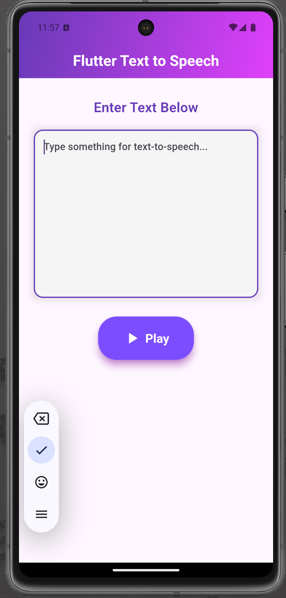

# Flutter Text-to-Speech App

This Flutter app is a simple demonstration of text-to-speech functionality, allowing users to input text which is then converted to speech using the [flutter_tts](https://pub.dev/packages/flutter_tts) package.

## Features

- Input any text to be converted into speech
- Simple and easy-to-use interface
- Uses the flutter_tts package for text-to-speech conversion
- Cross-platform: Works on both iOS and Android

## Screenshot

Here’s a screenshot of the app’s user interface:



## How to Run the Project

### Prerequisites

- Flutter SDK
- A code editor like Visual Studio Code or Android Studio
- A device/emulator to run the app

### Steps to Run:

1. Clone this repository.
   ```bash
   git clone <repository-url>
   ```
2. Navigate to the project directory:
   ```bash
   cd flutter-tts-app
   ```
3. Install dependencies by running:
   ```bash
   flutter pub get
   ```
4. Run the app on your connected device or emulator:
   ```bash
   flutter run
   ```

## Packages Used

- [flutter_tts](https://pub.dev/packages/flutter_tts): A Flutter plugin to easily integrate text-to-speech functionality.

## How It Works

- The user inputs text in the provided text field.
- By pressing the "Play" button, the app converts the input text into speech.
  
